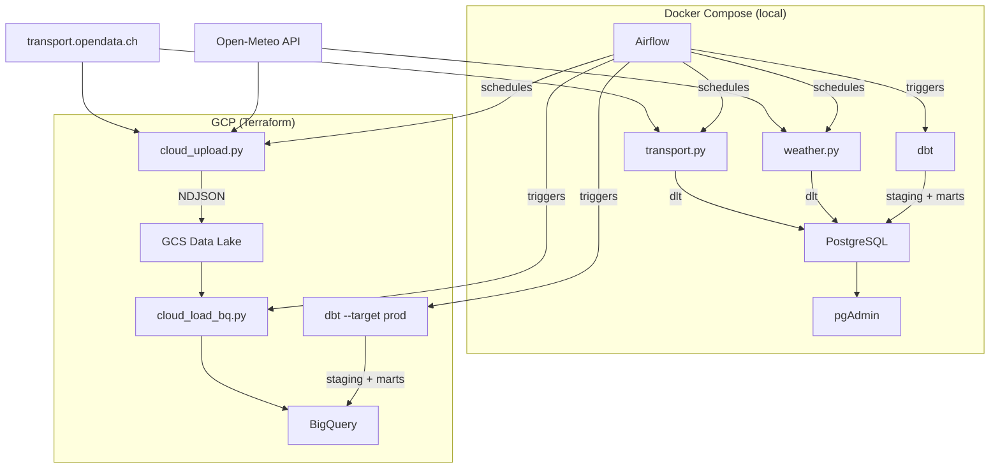

# Rush — Peer Review Manual

**Rush** is a data pipeline that helps HSLU students who work and study at the same time plan their exit from the office. It combines Swiss public transport schedules with weather forecasts to recommend the best departure window — minimizing delays, bad weather, and crowded trains.

This site is the peer review manual for the DENG course project. Each section maps directly to a graded requirement from the project description. Use the sidebar to navigate.

---

## Grading Overview

| Section | Points | Page |
|---------|--------|------|
| Dataset and Use Case | 5 | [1. Use Case](use-case.md) |
| Ingestion Pipeline | 10 | [2. Ingestion](ingestion.md) |
| Local Storage + Dockerized Environment | 10 | [3. Storage and Docker](storage-docker.md) |
| Data Transformation | 5 | [4. Transformation](transformation.md) |
| Workflow Orchestration | 10 | [5. Orchestration](orchestration.md) |
| Repository Requirements | 5 | [6. Repository](repository.md) |
| **Total** | **45** | |

---

## Quick Start

One command sets up everything on macOS, Linux, or Windows (WSL):

```bash
bash <(curl -fsSL https://raw.githubusercontent.com/javihslu/rush/main/install.sh)
```

This clones the repository, checks for required tools (installing anything
missing), and starts the full Docker stack. If you already have the repo
cloned, run `./setup.sh` from inside it.

??? note "Windows"
    1. Open PowerShell as Administrator and run `wsl --install`
    2. Restart your computer
    3. Install [Docker Desktop](https://www.docker.com/products/docker-desktop) (enable WSL 2 backend)
    4. Open your WSL terminal (Ubuntu) and run the command above

## What the Setup Does

When you run the install command, two scripts execute in sequence:

**Step 1 -- Bootstrap (`install.sh`)**

This is the script that curl downloads. It runs on your machine before the repo exists.

| Check | Action on failure |
|-------|-------------------|
| Git installed? | Prints install link and exits |
| Docker installed? | Prints install link and exits |
| Docker daemon running? | Prints "start Docker Desktop" and exits |
| Repo directory exists? | Asks to reuse or abort |

If all checks pass, it clones the repository and hands off to `setup.sh`.

**Step 2 -- Local setup (`setup.sh`)**

This runs inside the cloned repo. It reads all settings from `config.yaml`.

| Step | What happens |
|------|--------------|
| Tool check | Verifies Git, Docker, Docker Compose are present |
| gcloud CLI | If missing, offers to install via Homebrew (macOS) or apt/dnf (Linux) |
| Terraform | If missing, offers to install via Homebrew or apt/dnf |
| Generate `.env` | Reads `config.yaml` and writes `.env` with database, pgAdmin, and Airflow credentials |
| Docker stack | Runs `docker compose up -d --build` -- builds the image and starts all 7 services |
| GCP onboarding | If gcloud is available, runs `scripts/setup-gcp.sh` (auth, project, billing, APIs, Terraform) |
| Done | Prints service URLs |

Here is what a successful setup looks like in the terminal:

```
$ ./setup.sh
rush -- project setup
=====================

[ok] config.yaml loaded

[ok] git
[ok] docker
[ok] docker compose
[ok] gcloud CLI
[ok] Terraform

[ok] .env generated from config.yaml

Starting docker compose stack ...
[+] Building 20.7s (25/25) FINISHED
[+] up 15/15
 ✔ Network rush_default               Created
 ✔ Volume rush_postgres_data           Created
 ✔ Volume rush_airflow_postgres_data   Created
 ✔ Container rush-pgdatabase-1         Healthy
 ✔ Container rush-airflow-postgres-1   Healthy
 ✔ Container rush-pgadmin-1            Started
 ✔ Container rush-dev-1                Started
 ✔ Container rush-airflow-init-1       Exited
 ✔ Container rush-airflow-scheduler-1  Started
 ✔ Container rush-airflow-webserver-1  Started

Services:
NAME                          STATUS
rush-pgdatabase-1             Up (healthy)
rush-airflow-postgres-1       Up (healthy)
rush-pgadmin-1                Up
rush-airflow-webserver-1      Up
rush-airflow-scheduler-1      Up

=====================
Setup complete.

  pgAdmin:    http://localhost:8085
  Airflow:    http://localhost:8080
  PostgreSQL: localhost:5432
  Stop:       docker compose down
```

Once running:

| Service | URL | Credentials |
|---------|-----|-------------|
| Airflow | [http://localhost:8080](http://localhost:8080) | `airflow` / `airflow` |
| pgAdmin | [http://localhost:8085](http://localhost:8085) | `admin@admin.com` / `root` |
| PostgreSQL | `localhost:5432` | `root` / `root` / database `rush` |

If you have port conflicts, stop the other containers before running the setup.

To stop: `docker compose down`. To fully clean up: `./teardown.sh`.

---

## Architecture



---

## Tech Stack

| Component | Tool | Purpose |
|-----------|------|---------|
| Ingestion | dlt + Python | Batch data loading from APIs to PostgreSQL |
| Cloud Ingestion | google-cloud-storage + google-cloud-bigquery | Upload to GCS and load into BigQuery |
| Storage | PostgreSQL 18 | Local data warehouse |
| Cloud Storage | GCS + BigQuery | Cloud data lake and warehouse |
| Admin | pgAdmin | Database UI |
| Transformation | dbt-core | SQL-based staging and mart models (PostgreSQL + BigQuery) |
| Orchestration | Apache Airflow 2.10.5 | DAG scheduling, triggers, backfills |
| Containerization | Docker Compose | Full reproducible environment |
| Infrastructure | Terraform | GCS bucket + BigQuery dataset provisioning |
| Dependencies | uv + pyproject.toml | Fast Python package management |

---

## Data Sources

**Swiss public transport** — [transport.opendata.ch](https://transport.opendata.ch)
Departures, delays, and platform changes for any Swiss station. Free, no API key required.

**Weather forecasts** — [Open-Meteo](https://open-meteo.com)
7-day hourly forecast for Luzern: temperature, precipitation, snowfall, wind, visibility, and WMO weather codes. Free, no API key required.
