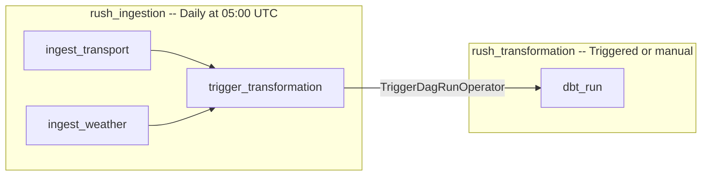

# 5. Workflow Orchestration

> **Points: 10** — Implement a workflow orchestration tool that schedules the batch pipeline, supports backfills, and can trigger future runs.

---

## Overview

Rush uses **Apache Airflow 2.10.5** with a LocalExecutor for orchestration. Two DAGs handle the full pipeline: one for ingestion (scheduled) and one for transformation (triggered).

**File:** [`dags/rush_pipeline.py`](https://github.com/javihslu/rush/blob/main/dags/rush_pipeline.py)



---

## DAG 1: Ingestion

| Property | Value |
|----------|-------|
| DAG ID | `rush_ingestion` |
| Schedule | `0 5 * * *` (daily at 05:00 UTC) |
| Start date | 2025-04-01 |
| Catchup | Disabled |
| Tags | `rush`, `ingestion` |

**Tasks:**

| Task | Type | Command | Runs |
|------|------|---------|------|
| `ingest_transport` | BashOperator | `cd /app && uv run python pipelines/ingestion/transport.py` | Parallel |
| `ingest_weather` | BashOperator | `cd /app && uv run python pipelines/ingestion/weather.py` | Parallel |
| `trigger_transformation` | TriggerDagRunOperator | Triggers `rush_transformation` | After both complete |

**Why parallel ingestion?** Transport and weather data come from independent APIs with no shared state. Running them in parallel cuts the total ingestion time roughly in half.

**Why a separate trigger?** Separating ingestion from transformation into two DAGs:

- Makes each DAG single-responsibility and easier to debug
- Allows manual re-runs of transformation without re-ingesting
- Follows the ELT pattern: load first, transform second

---

## DAG 2: Transformation

| Property | Value |
|----------|-------|
| DAG ID | `rush_transformation` |
| Schedule | `None` (triggered only) |
| Start date | 2025-04-01 |
| Catchup | Disabled |
| Tags | `rush`, `transformation` |

**Tasks:**

| Task | Type | Command |
|------|------|---------|
| `dbt_run` | BashOperator | `cd /app && uv run dbt run --project-dir pipelines/transformation/dbt --profiles-dir pipelines/transformation/dbt` |

This DAG runs all dbt models (2 staging views + 1 mart table) in dependency order. dbt handles the internal DAG resolution (staging before mart).

---

## Scheduling

The ingestion DAG runs daily at 05:00 UTC. This timing ensures:

- Fresh data is available before the workday starts in Switzerland (07:00 CET)
- The weather forecast covers the full upcoming day including evening commute hours
- Transport departures reflect the latest schedule updates from SBB

```
05:00 UTC ─── ingest_transport ──┐
                                  ├──── trigger_transformation ──── dbt_run
05:00 UTC ─── ingest_weather  ──┘
```

---

## Backfills

Airflow supports backfills natively. To re-run the pipeline for past dates:

```bash
# From the Airflow webserver container:
airflow dags backfill rush_ingestion \
    --start-date 2025-04-01 \
    --end-date 2025-04-07
```

Or use the Airflow UI: click on the `rush_ingestion` DAG, select a date range, and trigger.

**Note:** Backfilling weather data re-fetches the current forecast (Open-Meteo does not serve historical forecasts at the free tier). Transport data fetches are also for the current moment. To truly backfill historical data, the ingestion scripts would need to be extended with date-parameterized API calls.

---

## Manual Triggers

Both DAGs can be triggered manually from the Airflow UI:

1. Open [http://localhost:8080](http://localhost:8080)
2. Log in with `airflow` / `airflow`
3. Find the DAG in the list
4. Click the play button to trigger

The transformation DAG can also be triggered independently. This is useful when you change a dbt model and want to re-run transformations without re-ingesting data.

---

## Airflow Configuration

| Setting | Value | Why |
|---------|-------|-----|
| Executor | LocalExecutor | Single-machine setup; no need for Celery/Redis complexity |
| Metadata DB | PostgreSQL 16 (separate service) | Isolated from the data warehouse |
| DAGS_FOLDER | `/opt/airflow/dags` | Mounted from `./dags` in docker-compose |
| Retries | 1 | One automatic retry with 5-minute delay |

**Default args** applied to all tasks:

```python
default_args = {
    "owner": "rush",
    "retries": 1,
    "retry_delay": timedelta(minutes=5),
}
```

---

## How to Verify

**Check that both DAGs are loaded:**

```
$ docker compose exec airflow-scheduler bash -c 'airflow dags list' | grep rush

rush_ingestion      | /opt/airflow/dags/rush_pipeline.py | rush | False
rush_transformation | /opt/airflow/dags/rush_pipeline.py | rush | False
```

**Trigger the ingestion DAG:**

```
$ docker compose exec airflow-scheduler bash -c '
    airflow dags unpause rush_ingestion &&
    airflow dags unpause rush_transformation &&
    airflow dags trigger rush_ingestion'

Dag: rush_ingestion, paused: False
Dag: rush_transformation, paused: False

dag_id         | run_id                            | state
===============+===================================+=======
rush_ingestion | manual__2026-04-09T08:25:27+00:00 | queued
```

**After about 30 seconds, check both DAG runs:**

```
$ docker compose exec airflow-scheduler bash -c \
    'airflow dags list-runs -d rush_ingestion -o table'

dag_id         | run_id                            | state
===============+===================================+========
rush_ingestion | manual__2026-04-09T08:25:27+00:00 | success

$ docker compose exec airflow-scheduler bash -c \
    'airflow dags list-runs -d rush_transformation -o table'

dag_id              | run_id                                   | state
====================+==========================================+========
rush_transformation | manual__2026-04-09T08:25:30.537561+00:00 | success
```

Both DAGs show `success`. The transformation DAG was automatically triggered
by the ingestion DAG via `TriggerDagRunOperator` -- you did not have to start
it manually.

**Verify in the Airflow UI:**

| Check | How |
|-------|-----|
| DAGs are loaded | Open [http://localhost:8080](http://localhost:8080), confirm `rush_ingestion` and `rush_transformation` appear |
| Schedule is correct | Click `rush_ingestion`, check "Schedule" shows `0 5 * * *` |
| Trigger chain works | Trigger `rush_ingestion` manually; confirm `rush_transformation` runs automatically after |
| Tasks succeed | Check task status in the Airflow UI (all green) |
| Data is transformed | Query `dbt_dev.mart_departure_recommendations` in pgAdmin |
