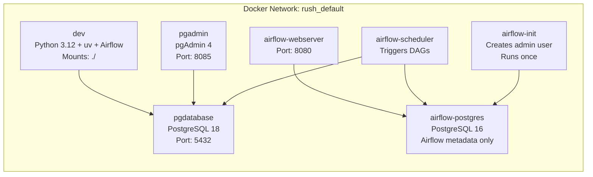

# 3. Local Storage and Dockerized Environment

> **Points: 10** — Local PostgreSQL accessible through pgAdmin, Docker Compose setup with all services on the same network, and a clear README for reproduction.

---

## Local Storage

Rush uses **PostgreSQL 18** as the local data warehouse. All ingested data lands in PostgreSQL, and all dbt transformations run against it.

**Schemas:**

| Schema | Contents | Written by |
|--------|----------|------------|
| `transport_raw` | Raw SBB departure records | `transport.py` (dlt) |
| `weather_raw` | Raw hourly weather forecasts | `weather.py` (dlt) |
| `dbt_dev` | Staging views and mart tables | dbt |

**pgAdmin** is included in the Docker stack and available at [http://localhost:8085](http://localhost:8085). Login credentials are defined in `config.yaml`:

```yaml
pgadmin:
  email: admin@admin.com
  password: root
```

The PostgreSQL server is pre-registered in pgAdmin — no manual connection setup required.

---

## Docker Compose Architecture

All services run in a single Docker Compose stack on the same network. The file is [`docker-compose.yaml`](https://github.com/javihslu/rush/blob/main/docker-compose.yaml).



**Services (7 total):**

| Service | Image | Purpose | Port |
|---------|-------|---------|------|
| `dev` | Custom (Dockerfile) | Development container with Python, uv, dbt, dlt | -- |
| `pgdatabase` | postgres:18 | Data warehouse | 5432 |
| `pgadmin` | dpage/pgadmin4 | Database UI | 8085 |
| `airflow-postgres` | postgres:16 | Airflow metadata database | -- |
| `airflow-init` | Custom | Creates Airflow admin user on first start | -- |
| `airflow-webserver` | Custom | Airflow web UI | 8080 |
| `airflow-scheduler` | Custom | Runs DAGs on schedule | -- |

**Why two PostgreSQL instances?** Airflow requires its own metadata database. Keeping it separate from the data warehouse avoids schema collisions and makes it easy to tear down one without affecting the other.

---

## Dockerfile

The [`Dockerfile`](https://github.com/javihslu/rush/blob/main/Dockerfile) builds a single image used by the dev container, Airflow webserver, and Airflow scheduler:

```
python:3.12-slim
  + uv (Python package manager)
  + Airflow 2.10.5 (pip install with constraints)
  + uv sync (project dependencies from pyproject.toml)
```

Airflow is installed via pip with a pinned constraints file because Airflow has strict dependency requirements that conflict with uv's resolver. All other dependencies (dbt, dlt, pandas, etc.) are installed via uv from `pyproject.toml`.

---

## Configuration

All configuration lives in [`config.yaml`](https://github.com/javihslu/rush/blob/main/config.yaml) — the single source of truth. The setup script generates a `.env` file from it for Docker Compose.

```yaml
project:
  name: rush

database:
  user: root
  password: root
  name: rush
  host: pgdatabase
  port: 5432

pgadmin:
  email: admin@admin.com
  password: root

airflow:
  user: airflow
  password: airflow

gcp:
  region: europe-west6
```

Python code reads config directly:

```python
from config import cfg
db_host = cfg["database"]["host"]
```

---

## Reproduction Steps

### Prerequisites

- Git
- Docker Desktop (or Docker Engine + Docker Compose)

### Build and Run

One command sets up everything on macOS, Linux, or Windows (WSL):

```bash
bash <(curl -fsSL https://raw.githubusercontent.com/javihslu/rush/main/install.sh)
```

This clones the repository, checks for required tools (installing anything
missing), and starts the full Docker stack. If you already have the repo
cloned, run `./setup.sh` from inside it.

??? note "Windows"
    1. Open PowerShell as Administrator and run `wsl --install`
    2. Restart your computer
    3. Install [Docker Desktop](https://www.docker.com/products/docker-desktop) (enable WSL 2 backend)
    4. Open your WSL terminal (Ubuntu) and run the command above

What the setup does:

1. Installs missing prerequisites (gcloud CLI, Terraform) if you agree
2. Creates `.env` from `config.yaml`
3. Starts the local Docker stack (PostgreSQL, pgAdmin, Airflow)
4. Runs `scripts/setup-gcp.sh` for cloud onboarding (auth, project, billing, APIs, Terraform)

### Verify

| Check | How |
|-------|-----|
| Airflow is running | Open [http://localhost:8080](http://localhost:8080), log in with `airflow` / `airflow` |
| pgAdmin is running | Open [http://localhost:8085](http://localhost:8085), log in with `admin@admin.com` / `root` |
| PostgreSQL is accessible | `docker compose exec pgdatabase psql -U root -d rush -c "SELECT 1"` |
| Data is loaded | Trigger the `rush_ingestion` DAG in Airflow, then query tables in pgAdmin |

### Teardown

```bash
./teardown.sh
```

Removes all containers, volumes, images, and generated files. Optionally destroys GCP resources via Terraform.
