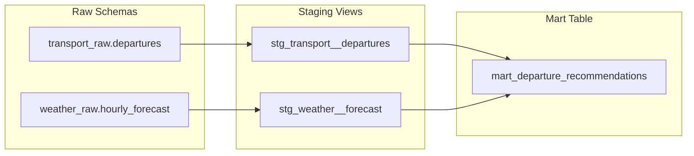

# 4. Data Transformation

> **Points: 5** — At least one transformation step that is clearly justified, supports the end user's use case, and solves a defined problem.

---

## Overview

Rush uses [dbt](https://www.getdbt.com/) for all transformations. Raw data from the ingestion layer is cleaned in staging models and combined into a business-ready mart table. No transformations happen during ingestion — the raw data is stored as-is.



**Model materialization:**

| Layer | Materialized as | Why |
|-------|----------------|-----|
| Staging | View | Lightweight; always reflects latest raw data without copying |
| Mart | Table | Pre-computed for fast queries; partitioned and clustered in BigQuery |

---

## Staging: Transport Departures

**File:** [`stg_transport__departures.sql`](https://github.com/javihslu/rush/blob/main/pipelines/transformation/dbt/models/staging/stg_transport__departures.sql)

**What it does:**

| Transformation | Input | Output | Why |
|----------------|-------|--------|-----|
| Cast to timestamp | `departure_scheduled` (string) | `departure_scheduled_at` (timestamp) | Enables time arithmetic for delay computation and joins |
| Cast to timestamp | `departure_actual` (string) | `departure_actual_at` (timestamp) | Same |
| Compute delay | Two timestamps | `delay_minutes` (integer) | Core input to the rush_score formula |
| Derive flag | delay_minutes | `is_delayed` (boolean) | Enables simple filtering: "show me only delayed departures" |
| Filter nulls | `departure_scheduled IS NOT NULL` | -- | Drops incomplete API records |

**Cross-database compatibility:** The delay computation uses a custom dbt macro that generates the correct SQL for both PostgreSQL and BigQuery:

=== "Macro"

    ```sql
    -- macros/delay_minutes.sql
    
        
            timestamp_diff({{ actual }}, {{ scheduled }}, MINUTE)
        
            extract(epoch from {{ actual }} - {{ scheduled }}) / 60
        
    
    ```

=== "PostgreSQL output"

    ```sql
    extract(epoch from
        cast(departure_actual as timestamp)
        - cast(departure_scheduled as timestamp)
    ) / 60
    ```

=== "BigQuery output"

    ```sql
    timestamp_diff(
        cast(departure_actual as timestamp),
        cast(departure_scheduled as timestamp),
        MINUTE
    )
    ```

---

## Staging: Weather Forecast

**File:** [`stg_weather__forecast.sql`](https://github.com/javihslu/rush/blob/main/pipelines/transformation/dbt/models/staging/stg_weather__forecast.sql)

**What it does:**

| Transformation | Input | Output | Why |
|----------------|-------|--------|-----|
| Cast to timestamp | `forecast_time` (string) | `forecast_hour` (timestamp) | Enables time-based join with departures |
| Map weathercode | WMO integer (0-99) | `weather_condition` (string) | Raw codes are not human-readable |
| Derive flag | precipitation, snowfall, weathercode | `bad_weather` (boolean) | Binary signal for weather impact |

**WMO weathercode mapping:**

| Code(s) | Label |
|---------|-------|
| 0 | Clear |
| 1, 2, 3 | Cloudy |
| 45, 48 | Fog |
| 51, 53, 55, 61, 63, 65, 80, 81, 82 | Rainy |
| 71, 73, 75, 77, 85, 86 | Snowy |
| 95, 96, 99 | Thunderstorm |

**bad_weather** is true when:

- Precipitation exceeds 2 mm, OR
- Any snowfall, OR
- Weathercode indicates fog, snow, or thunderstorm

---

## Mart: Departure Recommendations

**File:** [`mart_departure_recommendations.sql`](https://github.com/javihslu/rush/blob/main/pipelines/transformation/dbt/models/marts/mart_departure_recommendations.sql)

This is the final table that answers the user's question: "When should I leave?"

**Join logic:** Each departure is matched to its weather forecast by truncating the departure timestamp to the hour level. This uses `dbt.date_trunc()` for cross-database compatibility.

```sql
from departures d
left join weather w
    on date_trunc('hour', d.departure_scheduled_at) = w.forecast_hour
```

**Rush score formula:**

```
rush_score = delay_minutes + (precipitation * 2) + (snowfall * 5)
```

- **delay_minutes** — direct transport disruption
- **precipitation * 2** — rain makes the walk worse and often correlates with further delays
- **snowfall * 5** — snow has disproportionate impact on both walking and rail operations

**Recommendation labels:**

| Condition | Label |
|-----------|-------|
| No delay, no precipitation | Ideal |
| Delay <= 5 min, precipitation < 1 mm | Good |
| Delay <= 10 min or precipitation < 3 mm | Acceptable |
| Everything else | Avoid |

**BigQuery optimization:** When running against BigQuery (`--target prod`), the mart table is automatically partitioned by day on `departure_scheduled_at` and clustered by `station` and `category`. This is configured via dbt's `config()` block:

```sql
{{ config(
    materialized='table',
    partition_by={...} if target.type == 'bigquery' else none,
    cluster_by=[...] if target.type == 'bigquery' else none
) }}
```

**Why partition by day?** Typical queries filter by date ("show me recommendations for today"). Day-level partitioning ensures BigQuery only scans relevant partitions.

**Why cluster by station and category?** Users filter by their station and transport type. Clustering sorts data on disk by these columns, reducing scan costs further.

---

## Dual-Target Support

All dbt models work on both PostgreSQL (local) and BigQuery (cloud) without changes:

| Syntax | PostgreSQL | BigQuery | How |
|--------|-----------|----------|-----|
| Timestamp casts | `cast(x as timestamp)` | `cast(x as timestamp)` | ANSI SQL — works on both |
| Delay computation | `extract(epoch from ...)` | `timestamp_diff(...)` | Custom `delay_minutes` macro |
| Date truncation | `date_trunc('hour', x)` | `timestamp_trunc(x, hour)` | dbt built-in `dbt.date_trunc()` |
| Partition/cluster | Ignored | Applied | Conditional `config()` block |

Switch targets:

```bash
# Local (default):
dbt run --project-dir pipelines/transformation/dbt --profiles-dir pipelines/transformation/dbt

# Cloud:
dbt run --target prod --project-dir pipelines/transformation/dbt --profiles-dir pipelines/transformation/dbt
```

---

## dbt Source Definitions

Raw table schemas are documented in [`sources.yml`](https://github.com/javihslu/rush/blob/main/pipelines/transformation/dbt/models/staging/sources.yml). This file defines column-level descriptions for both `transport_raw.departures` and `weather_raw.hourly_forecast`, and it is used by dbt to validate source freshness and generate documentation.

---

## How to Verify

Run dbt manually or let Airflow trigger it. Here is the terminal output:

**Run all models:**

```
$ docker compose exec dev bash -c 'cd /app && uv run dbt run \
    --project-dir pipelines/transformation/dbt \
    --profiles-dir pipelines/transformation/dbt'

Concurrency: 4 threads (target='dev')

1 of 3 START sql view model dbt_dev.stg_transport__departures ............. [RUN]
2 of 3 START sql view model dbt_dev.stg_weather__forecast ................. [RUN]
1 of 3 OK created sql view model dbt_dev.stg_transport__departures ........ [CREATE VIEW in 0.05s]
2 of 3 OK created sql view model dbt_dev.stg_weather__forecast ............ [CREATE VIEW in 0.05s]
3 of 3 START sql table model dbt_dev.mart_departure_recommendations ....... [RUN]
3 of 3 OK created sql table model dbt_dev.mart_departure_recommendations .. [SELECT 100 in 0.03s]

Completed successfully

Done. PASS=3 WARN=0 ERROR=0 SKIP=0 NO-OP=0 TOTAL=3
```

All 3 models should show PASS. The staging models create views (fast, no data copy)
and the mart creates a table (pre-computed for queries).

**Query the mart table:**

```
$ docker compose exec pgdatabase psql -U root -d rush \
    -c "SELECT station, line_name, delay_minutes, recommendation, rush_score
         FROM dbt_dev.mart_departure_recommendations ORDER BY rush_score LIMIT 5;"

 station | line_name | delay_minutes | recommendation | rush_score
---------+-----------+---------------+----------------+-----------
 Luzern  | 002466    |             0 | Ideal          |          0
 Luzern  | 021938    |             0 | Ideal          |          0
 Luzern  | 002117    |             0 | Ideal          |          0
 Luzern  | 002021    |             0 | Ideal          |          0
 Luzern  | 021438    |             0 | Ideal          |          0
```

**Check recommendation distribution:**

```
$ docker compose exec pgdatabase psql -U root -d rush \
    -c "SELECT recommendation, count(*)
         FROM dbt_dev.mart_departure_recommendations
         GROUP BY recommendation ORDER BY count(*) DESC;"

 recommendation | count
----------------+-------
 Ideal          |    85
 Good           |    15
```
