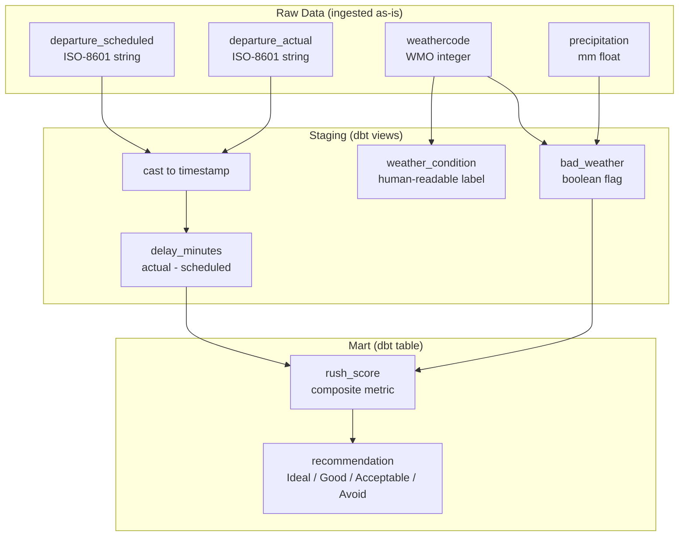

# 1. Dataset and Use Case

> **Points: 5** — Define a user persona, describe the analytics use case, and justify why the chosen transformations support it.

---

## User Persona

**Name:** Alex, 26, HSLU student (part-time MSc in Applied Information and Data Science).

**Situation:** Alex works full-time at an office in Luzern and attends evening lectures at HSLU. Every workday at around 17:00, Alex faces the same decision: leave now, wait 10 minutes, or push it to the next departure? The answer depends on train delays, platform changes, and whether it will rain on the walk to the station.

**Pain points:**

- Checking the SBB app, then the weather app, then deciding — every day
- Missing a train by 2 minutes because of unexpected delay information
- Getting caught in rain or snow without preparation
- No single view that combines transport reliability with weather conditions

**What Alex needs:** A single recommendation that accounts for both transport delays and weather conditions for the next few hours, so the decision is quick and informed.

---

## Use Case

Rush answers one question: **"When should I leave the office?"**

It consumes two data sources:

<div class="source-cards">
<div class="source-card">
<div class="source-header">Swiss Public Transport</div>
<div class="source-url">transport.opendata.ch</div>
<div class="source-body">
<p>Real-time and scheduled departures from any Swiss train station. Includes line names, categories (IC, IR, S-Bahn), scheduled and actual departure times, and platform assignments.</p>
<p><strong>Batch frequency:</strong> Daily at 05:00 UTC</p>
<p><strong>Key fields:</strong> station, departure_scheduled, departure_actual, category, destination</p>
</div>
</div>
<div class="source-card">
<div class="source-header">Weather Forecast</div>
<div class="source-url">open-meteo.com</div>
<div class="source-body">
<p>7-day hourly forecast for Luzern. Covers temperature, precipitation, snowfall, wind speed, visibility, and WMO weather codes.</p>
<p><strong>Batch frequency:</strong> Daily at 05:00 UTC (replaces previous forecast)</p>
<p><strong>Key fields:</strong> forecast_time, temperature_2m, precipitation, snowfall, windspeed_10m, weathercode</p>
</div>
</div>
</div>

**Sample transport data** (one row per departure):

| station | category | destination | departure_scheduled | departure_actual |
|---------|----------|-------------|---------------------|------------------|
| Luzern | IC | Zürich HB | 2025-04-09T17:00:00+0200 | 2025-04-09T17:03:00+0200 |
| Luzern | S1 | Baar | 2025-04-09T17:04:00+0200 | null |
| Luzern | IR | Bern | 2025-04-09T17:10:00+0200 | 2025-04-09T17:10:00+0200 |

**Sample weather data** (one row per forecast hour):

| forecast_time | temperature_2m | precipitation | snowfall | windspeed_10m | weathercode |
|---------------|----------------|---------------|----------|---------------|-------------|
| 2025-04-09T17:00 | 11.2 | 0.0 | 0.0 | 8.5 | 1 |
| 2025-04-09T18:00 | 9.8 | 1.4 | 0.0 | 12.3 | 61 |
| 2025-04-09T19:00 | 7.5 | 3.6 | 0.0 | 15.1 | 63 |

---

## Analytics Goal

The pipeline produces a **mart table** (`mart_departure_recommendations`) that gives each upcoming departure a composite score and a human-readable label:

| rush_score | recommendation | Meaning |
|------------|----------------|---------|
| 0 | Ideal | No delay, no precipitation |
| 1-5 | Good | Minor delay or light weather |
| 6-10 | Acceptable | Moderate delay or rain |
| 11+ | Avoid | High delay, heavy rain, or snow |

The score formula:

```
rush_score = delay_minutes + (precipitation_mm * 2) + (snowfall_cm * 5)
```

Each factor is weighted by its impact on the commute: snow disrupts more than rain, and both compound the effect of an existing delay.

---

## Why These Transformations

Every transformation in the pipeline exists to support this scoring goal:



| Transformation | Why it exists | Where |
|----------------|---------------|-------|
| Cast ISO strings to timestamps | Raw API returns strings; timestamps enable time arithmetic | [`stg_transport__departures.sql`](https://github.com/javihslu/rush/blob/main/pipelines/transformation/dbt/models/staging/stg_transport__departures.sql) |
| Compute `delay_minutes` | Core input to the rush_score — measures transport reliability | Same file |
| Derive `is_delayed` flag | Enables simple filtering for delayed-only analysis | Same file |
| Map WMO weathercode to label | Raw integer codes are not human-readable | [`stg_weather__forecast.sql`](https://github.com/javihslu/rush/blob/main/pipelines/transformation/dbt/models/staging/stg_weather__forecast.sql) |
| Derive `bad_weather` flag | Binary signal for weather impact on commute | Same file |
| Join + compute `rush_score` | The core business metric that powers recommendations | [`mart_departure_recommendations.sql`](https://github.com/javihslu/rush/blob/main/pipelines/transformation/dbt/models/marts/mart_departure_recommendations.sql) |
| Classify into recommendation | Translates numeric score into an actionable label for the user | Same file |
